# 中英文翻译系统
## 1. 引言
### 1.1 编写目的
编写本设计的目的是为了准确阐述基于Transformer的中英文翻译系统的具体实现思路和方法，即系统的详细架构和实现逻辑，主要包括程序系统的结构以及各层次中每个程序的设计考虑。预期读者为项目全体成员，包括运行维护和测试人员。
### 1.2 项目背景
- 系统名称：中英文翻译系统
- 任务提出者：东南大学23级专业技能实训
- 开发者：中英文翻译系统项目组
- 用户和运行该程序系统的计算中心：略。
### 1.3 定义
#### 1.3.1 技术类
1. 吞吐量
 “吞吐量”指系统在单位时间内可处理的输入数量。在 GPU 环境下，系统应能支持至少 50 句/秒的并发翻译吞吐量（批量处理）。
2. 延迟
“延迟”指从用户输入到系统输出结果所需的时间。在指定硬件环境下（CPU: Intel i7, GPU: NVIDIA GTX 1080Ti），对于长度小于 50 个字符的句子，单次翻译平均响应时间应低于 500 毫秒。
3. BLEU Score
“BLEU Score”是一种自动评估机器翻译文本与人工参考译文相似度的指标。在 XXX 数据集上，本系统的 BLEU Score 可达到 XXX，超过当前主流开源基线模型。
#### 1.3.2 业务类
1. 翻译系统
本项目所指的“翻译系统”是一个集成中英双向神经机器翻译模型，并提供图像识别处理、用户交互等功能的 Web 服务，支持中英文双向翻译、批量翻译，以及 API 接口调用。
2. 源语言
 “源语言”指用户输入待翻译文本的原始语言。例如：在中文→英文翻译中，源语言为中文。
3. 目标语言
 “目标语言”指用户希望将源文本翻译成的语言。例如：在中文→英文翻译中，目标语言为英文。
4. 输入
本项目所指的“输入”是指用户提交的原始内容，可包括文本、图片、JSON 数据及多格式文档。单次输入不得超过 XXX 字符。
5. 输出
“输出”是指系统处理输入后返回的翻译内容。系统支持保留输入格式，用户可对结果进行个性化修改。
6. 实时翻译
“实时翻译”指在实时对话或文本输入过程中，系统能够即时完成语言转换的功能。
7. 批量处理
“批量处理”指系统支持用户一次性上传包含大量文本的文件进行翻译，支持多种格式，单个文件大小不得超过 XXX。翻译结果将保持原文件的排版格式。
### 1.4 参考资料
- 《中英文翻译系统需求说明》
- 《中英文翻译系统概要设计》
- 《Python语言编码规范》

## 2. 项目概述
随着跨境交流和全球化进程的加快，企业和个人对高效、准确的翻译工具需求日益增长。无论是在国际商务谈判中，还是在科研资料查询、出国旅行、外语学习等场景下，都需要便捷的中英文翻译支持。为了满足用户在多样化场景下的即时翻译需求，我们自主研发了中英文翻译软件。软件通过统一的语言处理平台，不仅实现了文本、图片和文档翻译，以及翻译历史的高效管理，还提供了模型选用、词汇解读和语音朗读等扩展功能，从而为用户打造一体化的智能翻译解决方案。该软件不仅支持常见的中英文互译，还能为用户提供快速、稳定且高质量的翻译体验，大幅提升跨语言沟通的效率。
结合项目整体目标，系统的功能设计主要分为登陆注册和翻译服务两大部分。登陆注册包含三个主要业务审核：用户注册、用户登录以及找回密码。翻译服务包含八个主要业务审核：文本翻译、识图翻译、文件翻译、单句圈中、历史记录、设置、模型选用以及反馈。
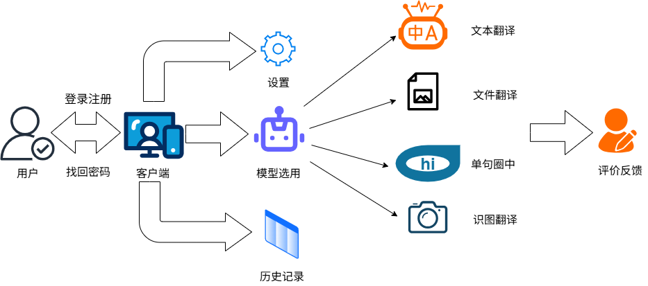

## 3. 总体设计(TODO)

## 4. 界面设计
### 4.1 用户注册界面设计
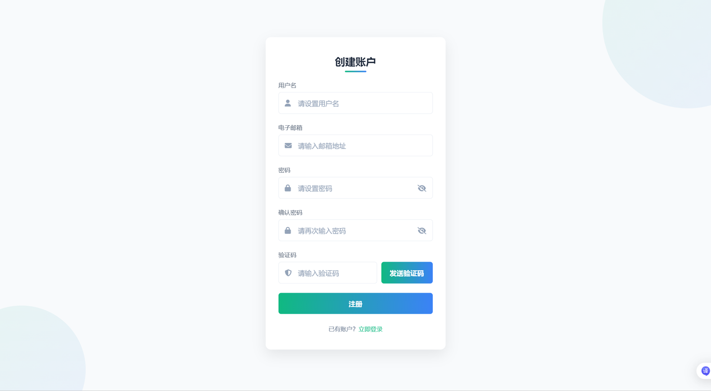

### 4.2 用户登录界面设计
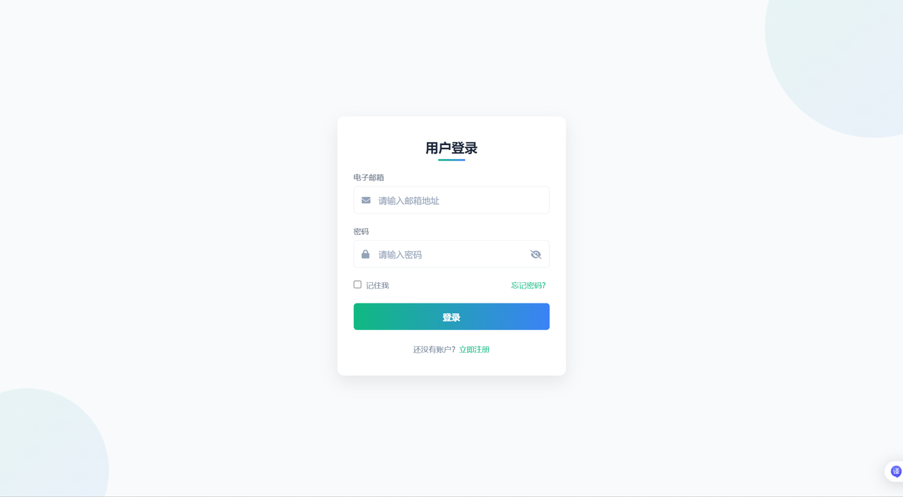

### 4.3 找回密码界面设计
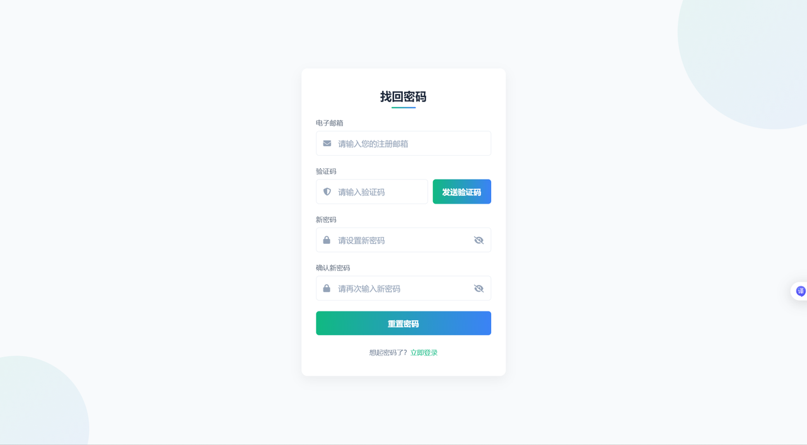

### 4.4 设置界面设计

### 4.5 翻译界面设计
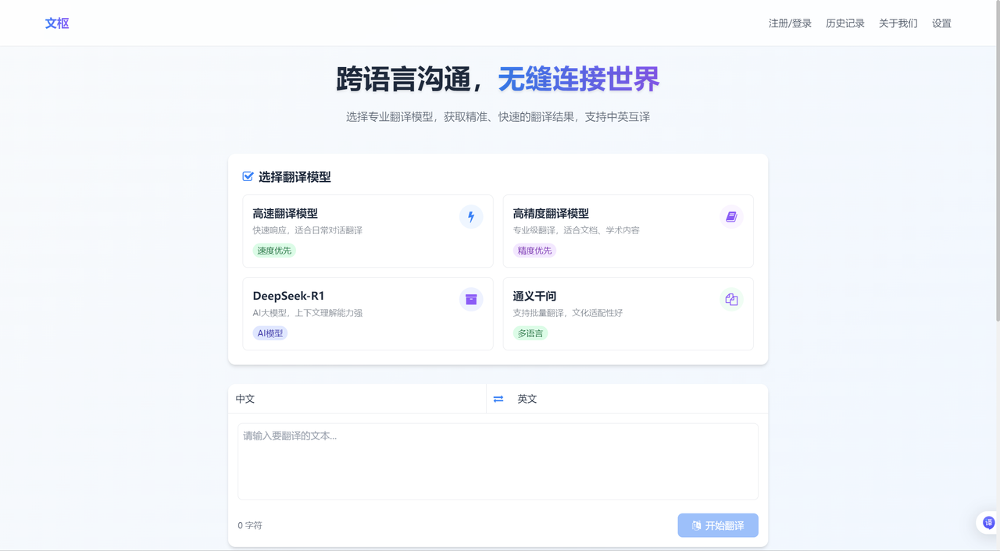

### 4.6 历史记录界面设计
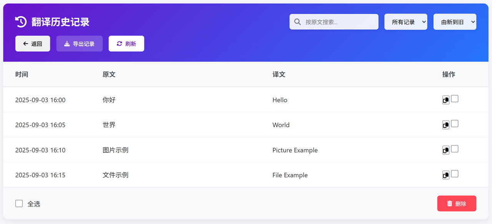

## 5. 单元模块设计
### 5.1 数据访问
#### 5.1.1 UserDao

| 说明                | 详情                                                                 |
|---------------------|----------------------------------------------------------------------|
| 1. 成员变量         | • userId：用户唯一标识符 • email：邮箱账号 • password：密码   |
| 2. createUserDao(email, password) | 功能：创建用户并返回用户唯一标识符（用于注册） 参数：email（邮箱账号）、password（密码） |
| 3. retrieveUserDao(email) | 功能：查询用户唯一标识符和密码（用于登录） 参数：email（邮箱账号） |
| 4. updateUserDao(userId, password) | 功能：更新用户密码 参数：userId（用户唯一标识符）、password（新密码） |
| 5. deleteUserDao(userId) | 功能：删除用户 参数：userId（用户唯一标识符） |

#### 5.1.2 SettingDao

| 说明                | 详情                                                                 |
|---------------------|----------------------------------------------------------------------|
| 1. 成员变量         | • userId：用户唯一标识符 • username：用户名 • avatar：头像 • size：字号 • color：颜色 |
| 2. createSettingDao(userId, username, avatar, size, color) | 功能：创建用户设置信息 参数：userId（用户唯一标识符）、username（用户名）、avatar（头像）、size（字号）、color（颜色） |
| 3. retrieveSettingDao(userId) | 功能：查询用户名、头像、字号、颜色（用于登录加载配置） 参数：userId（用户唯一标识符） |
| 4. updateUsernameDao(userId, username) | 功能：更新用户名 参数：userId（用户唯一标识符）、username（新用户名） |
| 5. updateAvatarDao(userId, avatar) | 功能：更新头像 参数：userId（用户唯一标识符）、avatar（新头像） |
| 6. updateSizeDao(userId, size) | 功能：更新字号 参数：userId（用户唯一标识符）、size（新字号） |
| 7. updateColorDao(userId, color) | 功能：更新颜色 参数：userId（用户唯一标识符）、color（新颜色） |
| 8. deleteSettingDao(userId) | 功能：删除用户设置信息 参数：userId（用户唯一标识符） |

#### 5.1.3 ModelDao

| 说明                | 详情                                                                 |
|---------------------|----------------------------------------------------------------------|
| 1. 成员变量         | • userId：用户唯一标识符 • zh_en：翻译方向 • models：模型配置 |
| 2. createModelDao(userId, zh_en, models) | 功能：创建用户翻译配置信息 参数：userId（用户唯一标识符）、zh_en（翻译方向）、models（模型配置） |
| 3. retrieveModelDao(userId) | 功能：查询用户翻译配置信息 参数：userId（用户唯一标识符） |
| 4. updateZH_ENDao(userId, zh_en) | 功能：更新翻译方向配置信息 参数：userId（用户唯一标识符）、zh_en（新翻译方向） |
| 5. updateModelsDao(userId, models) | 功能：更新模型选用配置信息 参数：userId（用户唯一标识符）、models（新模型配置） |
| 6. deleteModelDao(userId) | 功能：删除用户翻译配置信息 参数：userId（用户唯一标识符） |

#### 5.1.4 HistoryDao

| 说明                | 详情                                                                 |
|---------------------|----------------------------------------------------------------------|
| 1. 成员变量         | • userId：用户唯一标识符 • hisId：翻译记录对应唯一标识符 • date：日期 • model：选用模型种类 • type：翻译文件格式 • input：输入文本 • output：输出文本 |
| 2. createHistoryDao(userId, date, model, type, input, output) | 功能：创建翻译记录并返回翻译记录对应唯一标识符 参数：userId（用户唯一标识符）、date（日期）、model（选用模型种类）、type（翻译文件格式）、input（输入文本）、output（输出文本） |
| 3. retrieveHistoryDao(userId, hisId) | 功能：查询单条翻译历史信息 参数：userId（用户唯一标识符）、hisId（翻译记录唯一标识符） |
| 4. deleteHistoryDao(userId) | 功能：删除翻译记录 参数：userId（用户唯一标识符） |

#### 5.1.5 FeedbackDao

| 说明                | 详情                                                                 |
|---------------------|----------------------------------------------------------------------|
| 1. 成员变量         | • userId：用户唯一标识符 • hisId：翻译记录对应唯一标识符（已存入HistoryDao） • model：反馈模型种类 • judge：评价好坏 • text：评价内容 |
| 2. createFeedbackDao(userId, hisId, model, judge, text) | 功能：创建反馈记录 参数：userId（用户唯一标识符）、hisId（翻译记录唯一标识符）、model（反馈模型种类）、judge（评价好坏）、text（评价内容） |
| 3. deleteFeedbackDao(userId, hisId) | 功能：删除反馈记录 参数：userId（用户唯一标识符）、hisId（翻译记录唯一标识符） |

#### 5.1.6 AuthCodeDao

| 说明                | 详情                                                                 |
|---------------------|----------------------------------------------------------------------|
| 1. 成员变量         | • account：账户 • postTime：请求时间 • code：验证码           |
| 2. createAuthCodeDao(account, postTime, code) | 功能：创建验证信息 参数：account（账户）、postTime（请求时间）、code（验证码） |
| 3. retrieveAuthCodeDao(account) | 功能：查看验证信息 参数：account（账户） |
| 4. deleteAuthCodeDao(account) | 功能：删除验证信息 参数：account（账户） |

#### 5.1.7 AuthTokenDao
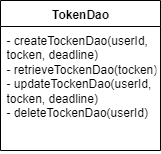

| 说明                | 详情                                                                 |
|---------------------|----------------------------------------------------------------------|
| 1. 成员变量         | • userId：用户唯一标识符 • token：令牌内容 • deadline：截止时间 |
| 2. createTokenDao(userId, token, deadline) | 功能：创建令牌信息 参数：userId（用户唯一标识符）、token（令牌内容）、deadline（截止时间） |
| 3. retrieveTokenDao(token) | 功能：查询令牌信息（返回userId 和 deadline） 参数：token（令牌内容） |
| 4. updateTokenDao(userId, token, deadline) | 功能：更新令牌信息 参数：userId（用户唯一标识符）、token（新令牌内容）、deadline（新截止时间） |
| 5. deleteTokenDao(userId) | 功能：删除令牌信息（用户注销） 参数：userId（用户唯一标识符） |

### 5.2 业务服务
#### 5.2.1 类图设计
##### 5.2.1.1 类关系结构图
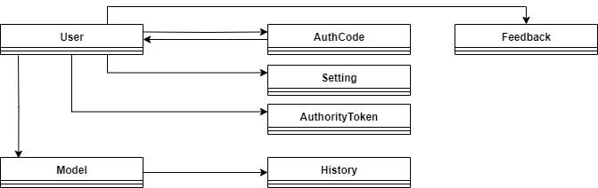

##### 5.2.1.2 时序图
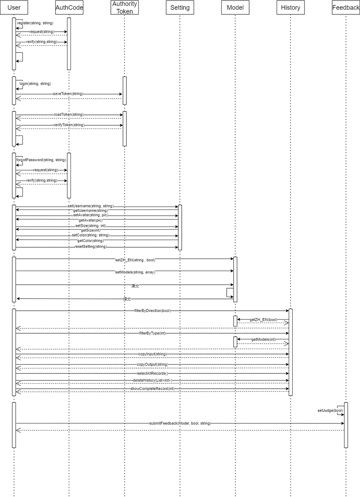

#### 5.2.2 类的详细设计描述
##### 5.2.2.1 User（用户管理类）

| 方法签名                                  | 功能描述               |
|-------------------------------------------|------------------------|
| bool register(string account, string password, string username) | 用户注册新账户         |
| AuthorityToken login(string account, string password) | 用户登录并获取令牌     |
| bool forgotPassword(string account, string newPassword) | 用户重置账户密码       |

##### 5.2.2.2 Setting（设置管理类）
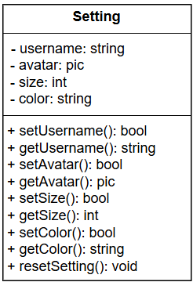

| 方法签名                                  | 功能描述               |
|-------------------------------------------|------------------------|
| bool setUsername(string account, string username) | 初始化或更改用户名     |
| string getUsername(string account)         | 查询用户用户名         |
| bool setAvatar(string account, pic avatar) | 用户更改头像           |
| pic getAvatar(string account)             | 查询用户头像           |
| bool setSize(string account, int size)    | 用户更改字体大小       |
| int getSize(string account)                | 查询用户字体大小       |
| bool setColor(string account, string color) | 用户更改背景颜色       |
| string getColor(string account)           | 查询用户背景颜色       |
| void resetSetting(string account)         | 重置设置信息           |

##### 5.2.2.3 Model（模型配置类）
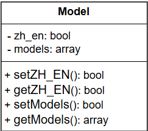

| 方法签名                                  | 功能描述               |
|-------------------------------------------|------------------------|
| bool setZH_EN(string token, bool zh_en)   | 用户更改翻译方向       |
| bool getZH_EN(string token)               | 查询用户翻译方向       |
| bool setModels(string token, array models) | 用户更改模型配置       |
| array getModels(string token)             | 查询用户模型配置       |

##### 5.2.2.4 History（历史记录类）
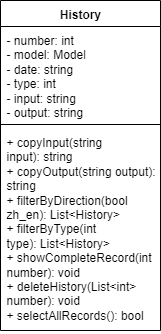

| 方法签名                                  | 功能描述               |
|-------------------------------------------|------------------------|
| string copyInput(string input)            | 复制原文               |
| string copyOutput(string output)          | 复制译文               |
| List<History> filterByDirection(bool zh_en) | 按翻译方向筛选记录     |
| List<History> filterByType(int type)      | 按翻译方式筛选记录     |
| void showCompleteRecord(int number)       | 在主界面显示完整记录   |
| void deleteHistory(List<int> recordNumbers) | 批量删除历史记录       |
| bool selectAllRecords()                   | 全选/取消全选记录      |

##### 5.2.2.5 Feedback（反馈类）
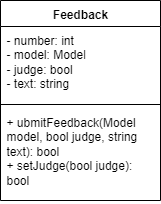

| 方法签名                                  | 功能描述               |
|-------------------------------------------|------------------------|
| bool submitFeedback(Model model, bool judge, string text) | 提交用户反馈           |
| void setJudge(bool judge)                 | 设置反馈类型（好评/差评） |

##### 5.2.2.6 AuthCode（验证码管理类）
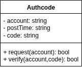

| 方法签名                                  | 功能描述               |
|-------------------------------------------|------------------------|
| bool request(string account)              | 请求验证码并返回状态（成功/失败） |
| bool verify(string account, string code)  | 检查验证码是否与账户匹配，返回匹配结果（正确/错误） |

##### 5.2.2.7 AuthorityToken（本地令牌管理类）
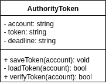

| 方法签名                                  | 功能描述               |
|-------------------------------------------|------------------------|
| void saveToken(string account)            | 为指定账户生成并保存令牌 |
| bool loadToken(string account)            | 加载指定账户的本地令牌，返回加载结果（成功/失败） |
| bool verifyToken(string account)          | 验证指定账户的令牌有效性，返回验证结果（有效/无效） |

### 5.3 模型服务
#### 5.3.1 类图设计
##### 5.3.1.1 类关系结构图

## 6. 数据库设计

### 6.1 数据库整体结构

### 6.2 系统管理

系统管理表格清单

| 序号 | 表名          | 注释     |
| :--: | ------------- | -------- |
|  1   | TRS_USER      | 系统用户 |
|  2   | TRS_SETTING   | 用户设置 |
|  3   | TRS_AUTHCODE  | 验证码   |
|  4   | TRS_AUTHTOKEN | 本地令牌 |

#### 6.2.1 TRS_USER表结构

| 序号 |   列名   |  数据类型   |      注释      |
| :--: | :------: | :---------: | :------------: |
|  1   |  userId  |     INT     | 用户唯一标识符 |
|  2   |  email   | VARCHAR(64) |    邮箱账号    |
|  3   | password | VARCHAR(32) |      密码      |

#### 6.2.2 TRS_SETTING表结构

| 序号 |   列名   |   数据类型   |      注释      |
| :--: | :------: | :----------: | :------------: |
|  1   |  userId  |     INT      | 用户唯一标识符 |
|  2   | username | VARCHAR(128) |     用户名     |
|  3   |  avatar  |     BLOB     |      头像      |
|  4   |   size   |     INT      |      字号      |
|  5   |  color   | VARCHAR(10)  |      颜色      |

#### 6.2.3 TRS_AUTHCODE 表结构

| 序号 |   列名   |  数据类型  |   注释   |
| :--: | :------: | :--------: | :------: |
|  1   | account  | VARCHAR(n) |   账户   |
|  2   | postTime |  DATETIME  | 请求时间 |
|  3   |   code   | VARCHAR(n) |  验证码  |

#### 6.2.4 TRS_AUTHTOKEN 表结构 

| 序号 |   列名   |  数据类型   |   注释   |
| :--: | :------: | :---------: | :------: |
|  1   | account  | VARCHAR(64) |   账户   |
|  2   |  token   | VARCHAR(32) | 令牌内容 |
|  3   | deadline |    DATE     | 截止时间 |

### 6.3 业务服务管理  

业务服务管理表格清单

| 序号 |      表名      |   注释   |
| :--: | :------------: | :------: |
|  1   |  TRS_T_MODEL   | 模型信息 |
|  2   | TRS_T_HISTORY  | 历史记录 |
|  3   | TRS_T_FEEDBACK | 反馈记录 |

#### 6.3.1 TRS_T_MODEL 表结构

| 序号 |  列名  |  数据类型  |      注释      |
| :--: | :----: | :--------: | :------------: |
|  1   | userId |    INT     | 用户唯一标识符 |
|  2   | zh_en  |  BOOLEAN   |    翻译方向    |
|  3   | models | VARCHAR(n) |    模型配置    |

#### 6.3.2 TRS_T_HISTORY 表结构

| 序号 |  列名  |  数据类型  |          注释          |
| :--: | :----: | :--------: | :--------------------: |
|  1   | userId |    INT     |     用户唯一标识符     |
|  2   | hisId  |    INT     | 翻译记录对应唯一标识符 |
|  3   |  date  |  DATETIME  |          日期          |
|  4   | model  | VARCHAR(n) |      选用模型种类      |
|  5   |  type  |    INT     |      翻译文件格式      |
|  6   | input  | VARCHAR(n) |        输入文本        |
|  7   | output | VARCHAR(n) |        输出文本        |

#### 6.3.3 TRS_T_FEEDBACK 表结构

| 序号 |  列名  |  数据类型  |          注释          |
| :--: | :----: | :--------: | :--------------------: |
|  1   | userId |    INT     |     用户唯一标识符     |
|  2   | hisId  |    INT     | 翻译记录对应唯一标识符 |
|  3   | model  | VARCHAR(n) |      反馈模型种类      |
|  4   | judge  |  BOOLEAN   |        评价好坏        |
|  5   |  text  | VARCHAR(n) |        平均内容        |

## 7.补充设计和说明（TODO）